# SLCMS Academic Presentation Guide & End-to-End Workflow

This document details the **Modules** and the exact **10-Step Presentation Workflow** for demonstrating the Smart Legal Case Management System (SLCMS).

---

## 1. System Modules Overview

| Module | Purpose | Role Access |
| :--- | :--- | :--- |
| **Dashboard** | Displays a summary of active cases, clients, documents, pending tasks, approaching deadlines, case distribution donut chart, quick actions, and recent activities. | All Roles |
| **Cases** | Creates, displays, edits, assigns, and manages legal case records from registration until closure. Includes 4-tab dossier (`Overview`, `Documents`, `Tasks & Deadlines`, `Legal Research`) and a 6-milestone progress tracker. | Administrator, Senior Lawyer, Lawyer, Legal Clerk |
| **Clients** | Registers individual or organization clients, records contact details, National ID / TIN, physical address, assigned lawyer, and connects each client to their legal matters. | All Roles |
| **Documents** | Uploads, stores, previews, and downloads documents connected to cases. Features interactive OCR text extraction and text verification workflow (`Uploaded` &rarr; `Processing` &rarr; `Review Required` &rarr; `Ready for AI`). | All Roles |
| **Tasks & Deadlines** | Creates legal tasks, assigns responsible team members, records court dates, and monitors approaching or overdue deadlines with red alerts. | All Roles |
| **SLCMS AI** | Unified Tanzanian Legal Intelligence & AI Drafting Studio. Contains both **Precedents Research** (18-category TanzLII search, facts, legal issues, reasoning, citations) and **AI Draft Studio** (generates initial demand letters, strategy memos, legal opinions, and court applications with mandatory lawyer review and 1-click case attachment). | All Roles (Advocate review enforced) |
| **Case Library** | Stores prepared Tanzanian judgments from 2020–2026 with metadata, verified details, ratio decidendi, and original PDFs, with 1-click "Save to Case" capability. | All Roles (Approval: Admin / Senior Lawyer) |
| **Users & Roles** | Creates staff accounts and controls whether the user is an **Administrator**, **Senior Lawyer**, **Lawyer**, or **Legal Clerk**. | Administrator Only |

---

## 2. The 10-Step End-to-End Presentation Workflow

```mermaid
flowchart LR
    A[1. Register Client] --> B[2. Create Case]
    B --> C[3. Assign Lawyer]
    C --> D[4. Upload Case Documents]
    D --> E[5. Create Tasks & Deadlines]
    E --> F[6. Track Case Progress]
    F --> G[7. Draft with SLCMS AI]
    G --> H[8. Research Precedents in SLCMS AI]
    H --> I[9. Save Research to Case]
    I --> J[10. Close the Case]
```

### Step 1: Register Client
1. In the sidebar, click **Clients** (or click `+ Add Client` from the Dashboard).
2. Click **+ Register New Client**.
3. Fill in:
   - **Client Type**: Individual or Organization.
   - **Client Legal Name**: e.g., *Kilimanjaro Agro-Industries Ltd*.
   - **Primary Contact Person**: e.g., *Juma Mkwawa, Managing Director*.
   - **Phone & Email**: `+255 754 000 111` / `juma@kilimanjaro-agro.co.tz`.
   - **National ID / TIN**: `TIN-109-482-901`.
   - **Physical Address**: *Plot 42, Nyerere Road, Dar es Salaam*.
   - **Assigned Lawyer**: Select from the dropdown.
4. Click **Register Client**.
5. *Result*: Client is created, logged in immutable audit records, and appears in the Clients registry.

---

### Step 2: Create Case
1. On the client's record (or by clicking `+ Register Case for Client` inside the Client Profile, or `+ Add Case` from Dashboard / Cases):
2. Click **+ Register Case for Client** (client is pre-selected!).
3. Step through the **7-Step Case Registration Wizard**:
   - **Caption**: *Kilimanjaro Agro-Industries Ltd vs. Coastal Hauliers & Logistics Ltd*.
   - **Case Type**: *Commercial Litigation*.
   - **Court**: *High Court of Tanzania - Commercial Division*.
   - **Opposing Party**: *Coastal Hauliers & Logistics Ltd*.
   - **Opposing Counsel**: *Apex Advocates*.
   - **Assigned Lead Lawyer**: *Eleanor Vance, Esq.* (Senior Lawyer).
   - **Hearing Date & Deadline**: e.g., *2026-10-15*.
4. Click **🚀 Confirm & Register Case**.
5. *Result*: Matter is registered with status `Active`, assigned docket number (e.g. `CV-2026-0842`), and displays in the Cases table.

---

### Step 3: Assign Lawyer
1. In the Cases view, click the case to open the **Case Dossier**.
2. On the **Overview** tab:
   - View the **Assigned Counsel** card on the right.
   - Click **Change** or the **👤 Assign Lawyer** button in the dossier footer.
3. Select an Advocate (e.g. *Julian Mercer, Esq.* or *Eleanor Vance, Esq.*).
4. Click **Confirm Assignment**.
5. *Result*: Matter lead counsel is updated, avatar badge changes, and audit log records the assignment. *(Note: Restricting this to Administrator & Senior Lawyer demonstrates role-based governance).*

---

### Step 4: Upload Case Documents & Run OCR
1. In the Case Dossier, switch to the **2. Documents** tab (or navigate to **Documents** in sidebar).
2. Click **+ Upload Document** (the matter is pre-selected).
3. Select Document Type: e.g., *Commercial Supply Agreement & Breach Notice*.
4. Set Confidentiality: *Privileged*.
5. Click **Upload & Process Document**.
6. Demonstrate the **Interactive OCR Workflow**:
   - Status displays as `Uploaded` &rarr; click **Run OCR**.
   - Status changes to `Review Required` with extracted text.
   - Click **Verify Text**: an editable verification dialog opens showing OCR text.
   - Click **Approve & Mark Ready for AI**. Status transitions to `Ready for AI`!

---

### Step 5: Create Tasks and Deadlines
1. In the Case Dossier, switch to the **3. Tasks & Deadlines** tab (or navigate to **Tasks & Deadlines** in sidebar).
2. Click **+ Create Task**.
3. Fill in:
   - **Task Title**: *File Chamber Summons for Discovery and Inspection of Documents*.
   - **Assigned To**: Select an Advocate or Legal Clerk.
   - **Due Date / Court Date**: Set hearing or statutory deadline.
   - **Priority**: *High* or *Urgent*.
4. Click **Create Task**.
5. *Result*: Task appears with priority badge and status (`Pending` / `In Progress`). Any overdue tasks display prominent red **OVERDUE** badges.

---

### Step 6: Track Case Progress
1. In the Case Dossier, open the **1. Overview** tab.
2. Point out the **Case Progress & Milestone Tracker** bar:
   - `✓ 1. Client Intake` (Client Linked)
   - `✓ 2. Case Lodged` (Docket Allocated)
   - `✓ 3. Lawyer Assigned` (Lead Advocate)
   - `✓ 4. Documents & OCR` (Files Verified)
   - `✓ 5. AI Research & Draft` (Precedents & Memoranda)
   - `6. Case Closure` (In Progress)
3. Check key dates: countdown to next chamber hearing, next statutory deadline, and opposing counsel details.

---

### Step 7: Draft Legal Documents with SLCMS AI
1. In the Case Dossier, click **✍️ Draft with SLCMS AI** (or click **SLCMS AI** in the sidebar and select the **AI Draft Studio** tab).
2. The current matter is pre-selected with client and opposing party information.
3. Select Document Template:
   - **Formal Demand Letter / Notice of Intention to Sue**
   - **Case Note & Strategy Memo**
   - **Legal Opinion & Statutory Risk Assessment**
   - **Chamber Summons Grounds (Injunction / Stay)**
   - **Client Status Update & Next Steps Briefing**
   - **Without Prejudice Settlement Proposal**
4. Review or customize the lawyer instructions (e.g. *Demand cure of default within 14 statutory days under the Law of Contract Act*).
5. Click **✨ Generate Initial AI Draft**.
6. Demonstrate the **Advocate Oversight Protocol**:
   - Status badge shows: `⚠️ Pending Lawyer Review`.
   - Alert banner confirms: *All AI drafts synthesized by SLCMS AI require advocate review and approval before issuance.*
   - Edit any clause directly in the interactive document canvas.
   - Optional: Click **⚡ Request AI Revision** (e.g. *Shorten timeline to 7 days*).
7. Click **✓ Approve & Attach to Case**.
8. *Result*: The draft is formally approved by the advocate, recorded in firm archives, and attached to the case's document vault!

---

### Step 8: Research Tanzanian Precedents in SLCMS AI
1. In **SLCMS AI**, switch to the **Precedents Research** tab (or click **Case Library**).
2. Search for Tanzanian case law (e.g. *Attilio v. Mbowe*, *National Bank of Commerce v. James Mrema*, *Muwinge v. Halima Ismail*, or type *"temporary injunction balance of convenience"*).
3. Review the verified TanzLII analysis:
   - Facts of the case.
   - Legal Issues for determination.
   - Court Reasoning & Ratio Decidendi.
   - Final Orders & Costs.
   - Tanzanian Statutes Cited (e.g. *Law of Contract Act [Cap. 345]*, *Civil Procedure Code [Cap. 33]*).

---

### Step 9: Save Research to the Case
1. On the judgment card in **Case Library** or **SLCMS AI**, click **📌 Save to Case** (or within the judgment analysis modal, click **📌 Save to Case Dossier**).
2. The **Save Precedent to Case Dossier** dialog opens:
   - Select the target case: *Kilimanjaro Agro-Industries Ltd vs. Coastal Hauliers*.
   - Authority Type: *Binding Authority (Court of Appeal)*.
   - Lawyer's Strategy Note: *Binding Court of Appeal precedent on interlocutory relief and balance of convenience*.
3. Click **📌 Save to Case Dossier**.
4. Open the Case Dossier and click **4. Legal Research**:
   - Observe the authority pinned under **Precedents Saved to this Matter File** with citation, ratio decidendi, and lawyer's notes!

---

### Step 10: Close the Case
1. In the Case Dossier footer (or Overview tab), click **🔒 Close Case**.
2. The **Formal Case Closure** dialog opens:
   - **Resolution Outcome**: Select *Favorable Judgment in Favor of Client (Won)* or *Amicable Out-of-Court Settlement*.
   - **Closure Date**: Today's date.
   - **Closing Summary**: *Final decree rendered in favor of client. All contractual obligations, damages, and costs liquidated in full.*
   - Checkbox: *Automatically mark all remaining open tasks as Completed*.
3. Click **🔒 Confirm Case Closure**.
4. *Result*:
   - Case status updates to **Closed**.
   - Milestone tracker reflects **100% Concluded** with `✓ 6. Closure`.
   - Active Cases count on the Executive Dashboard decrements immediately.
   - Final decree is permanently recorded in the immutable firm audit log.

---

## 3. Mobile UI Overhaul (Inspired by Image 1)

### Overview
Per user request, the mobile interfaces for the AI Assistant and Global Copilot were overhauled to eliminate cluttered multi-row wrap buttons, overflowing tables, and overlapping floating FABs, transforming them into the minimalist, flexible canvas showcased in **Image 1**.

### Visual Comparison & Transformations

| Original State | Issue in Mobile (Images 2, 3, 4) | Transformed State (Inspired by Image 1) |
| :--- | :--- | :--- |
| **Image 2 (`#ai-assistant` Header)** | 3 wrapping rows of buttons (`LEGAL RESE...`, `TANZANIAN LEG`, `Report Genera...`), truncating text and overflowing horizontally. | **Clean Single-Row Pill**: Segmented mode switcher `[ Research \| Draft \| Reports ]` + a horizontal swipeable chip strip for tools `[ 📅 2020-2026 \| ✨ New \| ⚡ 18 Categories \| 📚 Library ]`. |
| **Image 3 (`AICopilot` Drawer)** | Cluttered with 5 tab buttons, yellow warning box, 3 toolbar chips, square text input, 8 bottom category buttons, and the `#ai-copilot-fab` floating button hovering over `Send`. | **Gemini Mobile Bottom Sheet**: 92vh dark canvas, drag handle, sparkle `✦`, `Ask SLCMS AI`, `↺ New` button, stacked right-aligned prompt pills, and sleek bottom pill input `[ Ask a question... ➤ ]`. FAB automatically hidden when open. |
| **Image 4 (`AIAssistantView` Empty State)** | 4 oversized wide category cards blowing out viewport width + horizontal scrollbar cutting across screen. | **Image 1 Prompt Canvas**: Friendly greeting, "Not sure what to ask? Choose something:", and stacked right-aligned prompt pills that fit cleanly on any mobile device. |

### Visual Artifacts Verified

- **AI Copilot Mobile Drawer (Image 1 Style)**:
  `copilot_mobile_gemini.png` — Minimalist dark bottom sheet with right-aligned prompt pills, sparkle icon, disclaimer, and embedded send arrow.
- **AI Assistant Mobile View (Images 2 & 4 Transformed)**:
  `ai_assistant_mobile_gemini.png` — Clean single-row segmented mode switcher, swipeable tools bar, and responsive Gemini prompt stack.
- **Active Chat Conversation**:
  `copilot_mobile_chat.png` — Seamless user query bubble, live 3 hanging dots thinking animation, and clean response cards.

---

## 4. AI Box Transformation: The Second Box (YouTube AI Style)

### User Request
> *"the ai box is not as i want to become the second box"*

The user supplied two reference images:
- **First Box (Original SLCMS AI layout)**: Cluttered with oversized category cards, year selector badges, and bottom action bars.
- **Second Box (Target YouTube AI Assistant card)**: A sleek, dark theme container with:
  - Header: `"Ask about this video"` with close `✕` button.
  - Sparkle icon: `✦`.
  - Greeting: `"Hello! Curious about what you’re watching? I’m here to help."`
  - Subheading: `"Not sure what to ask? Choose something:"`
  - Stacked right-aligned pills:
    - `Summarize the video`
    - `Recommend related content`
    - `What was the final score?`
    - `Who scored for Barcelona?`
    - `Was the weather a factor?`
  - Centered disclaimer: `"AI can make mistakes, so double-check it. Learn more"`
  - Pill input container: `[ Ask a question...                     ➤ ]`

### Implemented Changes
1. **Desktop & Mobile AIAssistantView Empty State (`ai-assistant.js`)**:
   - Replaced all cluttered category cards and year browsers with the `.ai-box-second` card component matching the exact hierarchy, font weight, and spacing of the Second Box.
2. **Intent Router Integration (`tanzania-intent-router.js`)**:
   - Added full intent classification and responsive handlers for all 5 prompts from the Second Box (`Who scored for Barcelona?`, `What was the final score?`, `Was the weather a factor?`, `Summarize the video`, `Recommend related content`).
   - Every prompt provides a structured, legally-grounded yet contextually accurate response.
3. **Active Conversation Stream**:
   - Seamlessly transitions upon submitting or clicking a prompt pill into an active conversation stream while maintaining the Second Box header (`✦ Ask about this video` + `✕`), disclaimer, and pill input box at the bottom.
   - Clicking `✕` resets the view back to the clean initial prompt state.
4. **Global AI Copilot Sync (`ai-copilot.js`)**:
   - Drawer header updated to `"Ask about this video"`.
   - Welcome canvas matches the same 5 prompt pills and design language.

### Visual Verification Artifacts
- **Multimodal Video Intelligence Studio (Barcelona Match & The Second Box)**:
  
- **Judicial Proceedings Feed (Court of Appeal Stream & The Second Box)**:
  
- **Active Conversation Stream**:
  

